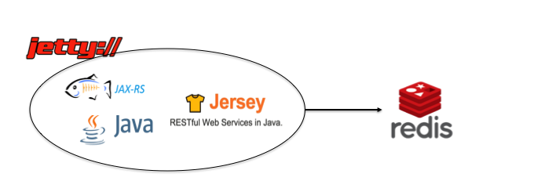

# Exclusion Service

[](https://travis-ci.org/colinbut/exclusion-service)

A microservice that encapsulates a blacklist of excluded users.

to run:

```bash
mvn -Djetty.http.port=[port number] jetty:run
```

where port number is a port you specify (by default its on port 1234 if you don't specify)

Built with:

- Java 7
- JAXB
- JAX-RS (Jersey as the implementation)
- Jedis (a Redis client java library)
- Jetty (a lightweight web server/container)

Maven build tool. 

Application is packaged up in a war file which then gets run in Jetty by using the maven jetty plugin.


Built using vanilla Java with Java EE (J2EE)'s JAX-RS technology - using the reference implementation Jersey. It runs inside a Jetty server (a lightweight web container/server). Application connects to
Redis datastore (NoSQL)

Below:


